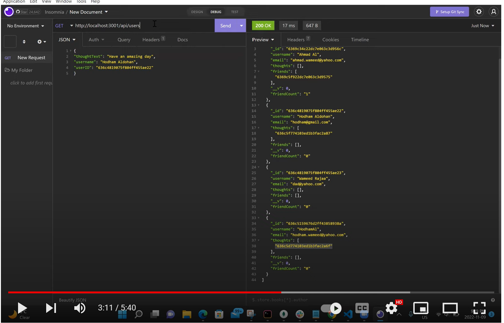
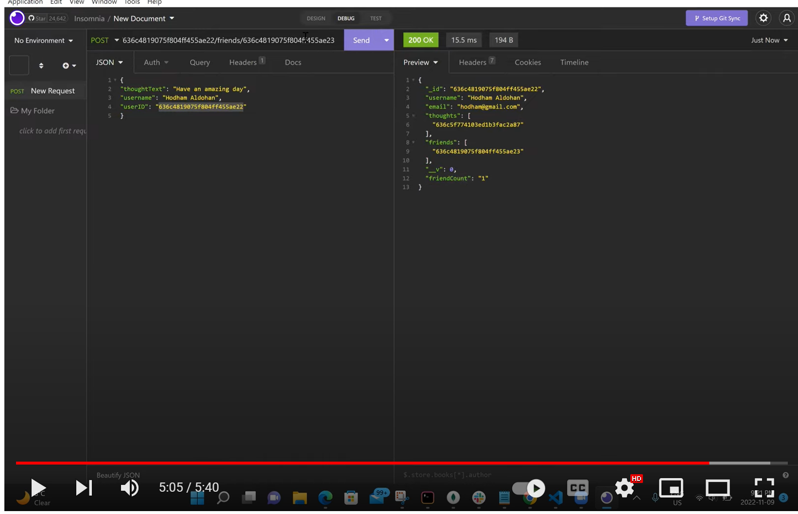

# Socialistic
 ## Demo
  - You can click on either the image or this link to access the video https://www.youtube.com/watch?v=pQs58ZQBDqY
 

## Description
Socialistic is a backend node.js application that utilizes a NoSQL database MongoDB and it's wrapper Mongoose. This RESTful APIs executes CRUD operations for users, thoughts, and reactions. Insomnia was used to demonstrate functionality when executing requests.
## features
- Ability to have a RESTful API.
- Ability to manipulate information through CRUD operations.
## Technologies Used
- javascript: to add functionality.
- Node.js: to run javaScript in the Backend (Environment).
- MongoDB/Mongoose: NoSQLto create Schemas/models for database.

## CLI Application Image

## Installation
### Clone code to your local machine and execute the following commands.
- `npm install`
- `node server.js`
